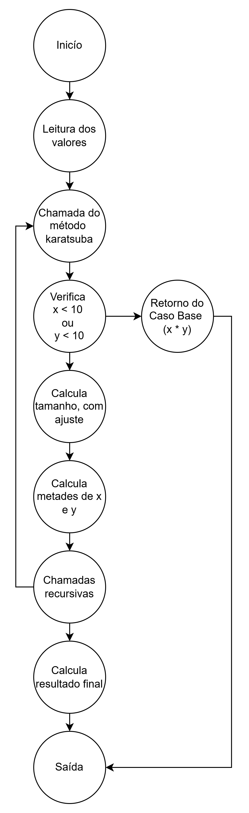

# Karatsuba Multiplication Algorithm

A Python implementation of Karatsuba's multiplication algorithm for efficient multiplication of large numbers.

## Algoritmo

### Algoritmo (Linha por Linha)

1. **break_in_half(x, n)**
   ```python
   def break_in_half(x, n):
        # Calcula o ponto médio usando divisão inteira
       m = 10**(n // 2)

       # Retorna a metade esquerda (quociente) e a metade direita (resto) do número
       return x // m, x % m
   ```
   - Divide um número em duas metades usando operações de divisão e módulo
   - Exemplo: 1234 com n = 4 se torna (12, 34)

2. **karatsuba(x, y)**
   ```python
   def karatsuba(x, y):
       # Caso base: multiplicação de um dígito
       if x < 10 or y < 10:
           return x * y

       # Calcula o número de dígitos
       n = max(len(str(x)), len(str(y)))

       # Se o número de dígitos for ímpar, adiciona 1. Isso é feito para garantir que os números sejam pares.
       if n % 2 != 0:
           n += 1

       # Divide os números na metade
       xl, xr = break_in_half(x, n)
       yl, yr = break_in_half(y, n)

       # Passos recursivos
       # Multiplicação das metades esquerdas
       a = karatsuba(xl, yl)
       # Multiplicação das metades direitas
       b = karatsuba(xr, yr)      
       # Multiplicação dos termos cruzados
       c = karatsuba(xl + xr, yl + yr)
       # Calcula o termo do meio
       d = c - a - b

       # Combina os resultados
       return (10**(n) * a) + (10**(n/2) * d) + b
   ```

## Executando o Projeto

1. Clone o repositório
   ```bash
   git clone https://github.com/seu-usuario/seu-repositorio.git
   ```
2. Certifique-se de que o Python 3.x está instalado
3. Execute o programa:
   ```bash
   python main.py
   ```
   ou
   ```bash
   python3 main.py
   ```
   ou
   ```bash
   py main.py
   ```
4. Digite dois números quando solicitado

## Relatório Técnico

### Análise de Complexidade Ciclomática

#### Grafo de Fluxo de Controle



#### Estrutura do Grafo
- Vértices (V) = 10
- Arestas (E) = 11
- Componentes Conectados (P) = 1

#### Cálculo da Complexidade Ciclomática
M = E - V + 2P

M = 11 - 10 + 2(1)

M = 3

Isso indica uma complexidade moderada com três caminhos independentes pelo código.

### Análise Assintótica da Complexidade

#### Complexidade de Tempo

1. **Melhor Caso: O(1)**
   - Ocorre quando os números são menores que 10

2. **Caso Médio: O(n^log₂3)**
   - Cenário mais comum
   - Três chamadas recursivas com tamanho n / 2

3. **Pior Caso: O(n^log₂3)**
   - Quando os números têm comprimentos muito grandes
   - Ainda mantém a mesma complexidade